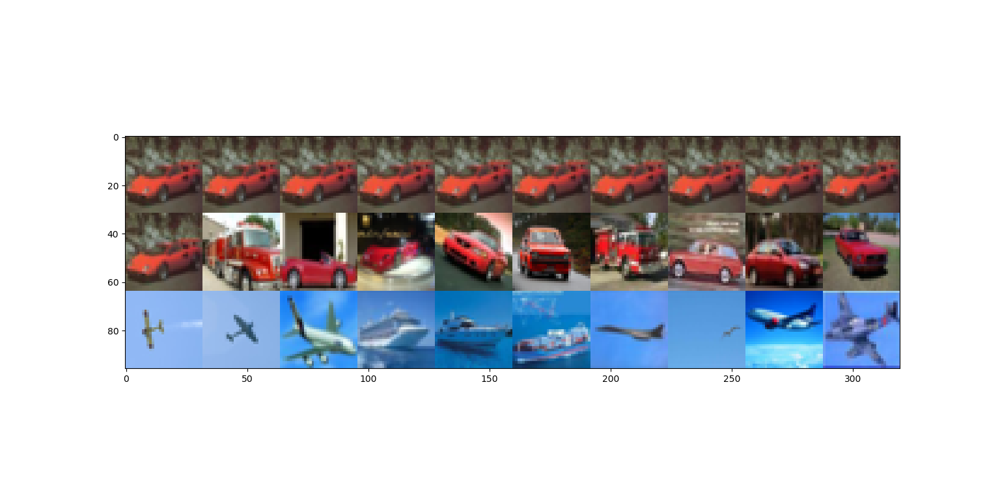
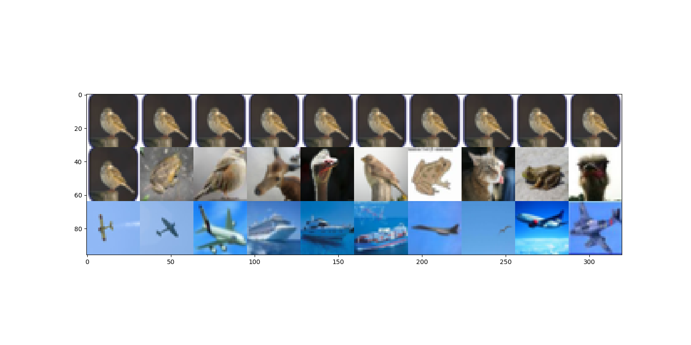
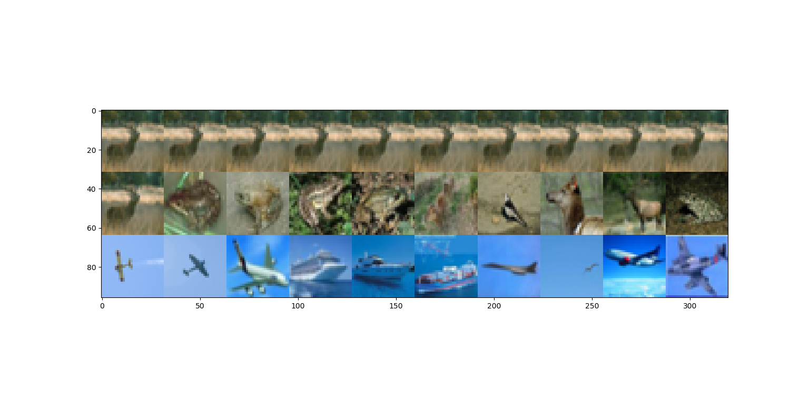
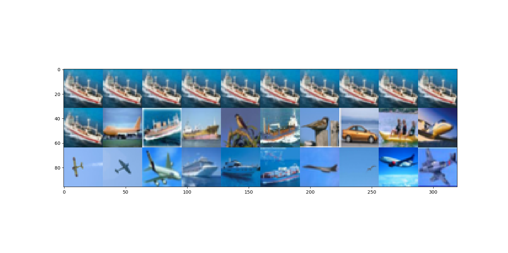

#Deep InfoMax Pytorch

Pytorch implementation of Deep InfoMax
https://arxiv.org/abs/1808.06670

Encoding data by maximimizing mutual information between the latent space and in this case, CIFAR 10 images.

Ported most of the code from rcallands chainer implementation.  Thanks buddy!  https://github.com/rcalland/deep-INFOMAX

Some Results...

Figure 1:  Top: a red lamborghini, Middle: 10 closest images in the latent space (L2 distance), Bottom: 10 farthest images in the latent space.

Some more results..

